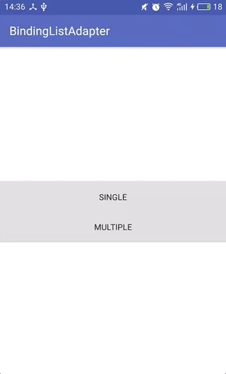

## BindingListAdapter

        

Say goodbye to repeated, redundant custom Adapters , Make the developer's focus on the data, beacuse data-driven UI

### demo

https://fabu.love/7me2fm

### Example

                       

#### more

PaoNet : [https://github.com/ditclear/paonet](https://github.com/ditclear/paonet)

### Download

```groovy
implementation 'com.ditclear:bindinglistadapter:1.0.1'
// if you use androidx
implementation 'com.ditclear:bindinglistadapterx:1.0.0'
```

### Quick Start

creating a single-type RecyclerView.Adapter with only a simple 3 step

1. Create a `list-item.xml` file in databinding form for Item

```xml
<?xml version="1.0" encoding="utf-8"?>
<layout xmlns:android="http://schemas.android.com/apk/res/android"
        xmlns:app="http://schemas.android.com/apk/res-auto">

    <data>

        <variable
                name="item"
                type="String"/>
        <variable
                name="presenter"
                type="io.ditclear.bindingadapter.ItemClickPresenter"/>
    </data>

    <TextView
            android:layout_width="match_parent"
            android:layout_height="?actionBarSize"
            android:onClick="@{(v)->presenter.onItemClick(v,item)}"
            android:gravity="center"
            android:text="@{item}"/>
</layout>
```

2. Create our `dataSource` and  `SingleTypeAdapter` in `Activity/Fragment` file

   ```kotlin
   val dataSource=ObservableArrayList<T>() //typically in the ViewModel layer
   val mAdapter by lazy {
       SingleTypeAdapter<T>(this, R.layout.list_item, dataSource)
      .apply{
          itemPresenter=this@currentActity
      }
   }
   ```

3. set `adapter` for `recyclerView`

   ```kotlin
   recyclerView.apply{
       adapter = mAdapter
     	layoutManager = LinearLayoutManager(context)
   }
   ```

Over, you're done. Then just change the data source

```kotlin
//add item
dataSource.add(item)
//remove item
dataSource.remove(item) // or dataSource.removeAt(indexOfItem)
//setNewList
dataSource.clear()
dataSource.addAll(newList)
//batch remove 
dataSouce.removeRange(startIndex ,offset) //kotin extension

//and so on
```

#### Why?

The Android DataBinding framework provides the `ObservableArrayList` class, which provides several callbacks corresponding to RecyclerView.Adapter.

```kotlin
  dataSource.addOnListChangedCallback(object : ObservableList.OnListChangedCallback<ObservableList<T>>() {
            override fun onChanged(contributorViewModels: ObservableList<T>) {
                notifyDataSetChanged()
            }

            override fun onItemRangeChanged(contributorViewModels: ObservableList<T>, i: Int, i1: Int) {
                notifyItemRangeChanged(i, i1)
            }

            override fun onItemRangeInserted(contributorViewModels: ObservableList<T>, i: Int, i1: Int) {
                notifyItemRangeInserted(i, i1)
            }

            override fun onItemRangeMoved(contributorViewModels: ObservableList<T>, i: Int, i1: Int, i2: Int) {
                notifyItemMoved(i, i1)
            }

            override fun onItemRangeRemoved(contributorViewModels: ObservableList<T>, i: Int, i1: Int) {
                if (contributorViewModels.isEmpty()) {
                    notifyDataSetChanged()
                } else {
                    notifyItemRangeRemoved(i,i1)
                }

            }
        })
```

### Usage

Provides [SingleTypeAdapter](library-kotlin/src/main/java/io/ditclear/bindingadapter/SingleTypeAdapter.kt) and [MultiTypeAdapter](library-kotlin/src/main/java/io/ditclear/bindingadapter/MultiTypeAdapter.kt)

- **SingleTypeAdapter**  

```kotlin
val dataSource=ObservableArrayList<T>()
val mAdapter by lazy {
    SingleTypeAdapter<T>(this, R.layout.list_item, dataSource)
}
```

- **MultiTypeAdapter**

```kotlin
val dataSource=ObservableArrayList<Any>()
val mAdapter by lazy {
    MultiTypeAdapter(this, dataSource, object : MultiTypeAdapter.MultiViewTyper {
        override fun getViewType(item: Any): Int =
            when(item){  //return Item View type
                is ItemWrapper -> item.type
                is String -> ItemType.TYPE_5
                else -> throw Resources.NotFoundException("${item::class} has not found it's ViewType")
            }

    }).apply {
        addViewTypeToLayoutMap(ItemType.TYPE_0, R.layout.multi_type_0)
        addViewTypeToLayoutMap(ItemType.TYPE_1, R.layout.multi_type_1)
        addViewTypeToLayoutMap(ItemType.TYPE_2, R.layout.multi_type_2)
        addViewTypeToLayoutMap(ItemType.TYPE_3, R.layout.multi_type_3)
        addViewTypeToLayoutMap(ItemType.TYPE_4, R.layout.multi_type_4)
        addViewTypeToLayoutMap(ItemType.TYPE_5, R.layout.multi_type_5)
        }
    }
```

### Click Event

[ItemClickPresenter](library-kotlin/src/main/java/io/ditclear/bindingadapter/ItemClickPresenter.kt) is provided to handle click events

```kotlin
//single type ： According to the viewId to distinguish
override fun onItemClick(v: View, item: String) {
     Toast.makeText(this,item,Toast.LENGTH_SHORT).show()
}
//multi type : According to the viewId or item's type to distinguish
 override fun onItemClick(v: View, item: Any) {
        when(item){
            is ItemWrapper -> Toast.makeText(this, item.bean, Toast.LENGTH_SHORT).show()
            is String -> Toast.makeText(this, item.split("").reversed().joinToString(""), Toast.LENGTH_SHORT).show()
        }
    }
```

in `list_item.xml` ，We need to bind the click event

```xml
<?xml version="1.0" encoding="utf-8"?>
<layout xmlns:android="http://schemas.android.com/apk/res/android"
        xmlns:app="http://schemas.android.com/apk/res-auto">

    <data>

        <variable
                name="item"
                type="String"/>
        <variable
                name="presenter"
                type="io.ditclear.bindingadapter.ItemClickPresenter"/>
    </data>

    <TextView
            android:onClick="@{(v)->presenter.onItemClick(v,item)}"
            android:text="@{item}"/>
</layout>
```

### ItemDecorator

If the above cannot meet the requirements, additional settings can be made by setting [ItemDecorator](library-kotlin/src/main/java/io/ditclear/bindingadapter/ItemDecorator.kt)

```kotlin
override fun decorator(holder: BindingViewHolder<ViewDataBinding>, position: Int, viewType: Int) {
	//do sth..
}
```

Similar to `onBindViewHolder` method


### Thanks To

[markzhai](https://github.com/markzhai)/[DataBindingAdapter](https://github.com/markzhai/DataBindingAdapter)

### License

[MIT](LICENSE.txt)